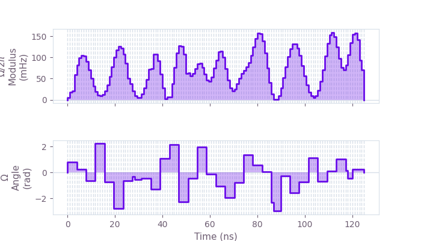
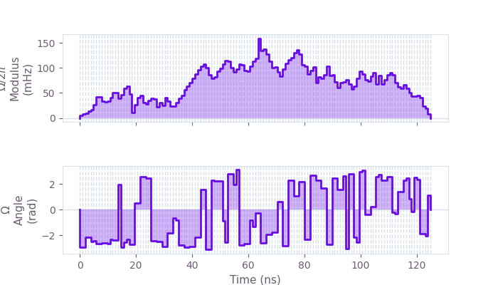

# 🌻 **Meliora** 🌻 - **Applied Quantum Learning Control**

## 🟣 **Our Team**
We are a team of 4 individuals from the **University of Rochester**, named after our school motto, meaning *"Ever Better"*.

|00⟩ Ryan Cocuzzo

|01⟩ Daniel Busaba

|10⟩ Michael Taylor

|11⟩ Dominick Harasimiuk

 

## 🟣 **Introduction**

### **Hadamard Gate Pulse**

We sought to design custom pulse envelope functions to deterministically apply logic gates to a superconducting Q-CTRL qubit. Specifically, we designed a pulse that is robust to environmental factors to implement a NOT logical gate and a Hadamard logical gate using microwave pulses on a real qubit system. To accomplish this, we took a two step approach consisting of both *Quantum Optimum Control* and *Quantum Learning Control methods*, balancing the shortfalls of each to find the optimum pulse function. Quantum Optimum Control is quick and efficient; however, it requires that the programmers know the Hamiltonian of the system very well to accomplish a sufficient degree of success. On the other hand, Quantum Learning Control does not use any knowledge of the system, relying on a *Genetic Machine Learning algorithm* to converge on a viable system. Consequentially, if given a poor starting point, it may not converge well. By first calculating a modified Quantum Optimum Control pulse from a semi-realistic model (first, using Q-CTRL's provided "Simulating a More Realistic Superconducting Qubit" example), we can find a very good starting point for the Quantum Learning Control method to then optimize into a viable pulse structure for a given pulse.

### 🟣 **NOT Gate Pulse**

## 🟣 **First Step: Quantum Optimum Control Optimization with Sinc Interpolation**
We were quickly able to generate a pulse that would easily satisfy the model. The issue though was this proposed pulse at scale is not very physically viable. Specifically, it would have a phase and amplitude that oscillated at incredibly fast rates. After experimenting with various different smoothing algorithms and parameters for the optimization, we settled on a method that would produce a more physically feasible pulse shape. We did this with a combination of two modifications to the method discussed in the Twitch stream. First, we changed the definition of the amplitude function in the optimization from a `bounded_optimization_variable` to an `anchored_difference_bounded_variables` and added a `difference_bound` constraint. This ensured that between the adjacent segments, the amplitude of the pulse would not change by more than a small tunable parameter. This made the pulse amplitude function more realistic and well behaved. However, this still left the phase as rapidly oscillating and the amplitude as having sharp peaks/troughs. To fix this, we purposely had the optimizer optimize over a relatively small number of segments and then upscaled it by using a sinc (aka sin(pi * x) / (pi * x)) function interpolation algorithm onto the amplitude. This smoothed out the peaks and valleys of the amplitude function, making it a more natural loooking function. The rapidly changing phase problem is also mitigated by this because the phase is simply copied n times for an upscaling factor of n. This increases the amount of time that the microwave pulse is at a given phase. To validate that the interpolated pulse function is still valid for the more realistic simulation, we plug the smoothed pulse back into this simulation and ensure that the error is still relatively small. By tuning the number of segments, the factor of upscaling and the amplitude difference_bound constraint, we reliably errors on the real qubit within **~5-10%**. This provided us with a good starting point to plug into our Quantum Learning Control Using Genetic Algorithm Postprocessing

## 🟣 **Second Step: Quantum Learning Control Using Genetic Algorithm Postprocessing**

After being pre-processed on a simulated Q-bit, the generated microwave is then optimized using a genetic algorithm. At the heart of the genetic algorithm is the loss or fitness function that evaluates how close the microwave is to making the Q-bit behave as desired. We defined this function as the real mean squared of the expected and actual Q-bit value probabilities divided by the repetition count. We divide by the repetition count to provide some penalty for signals with error but to maintain priority on an accurate first shot.

# 🟣 Get Started

To build the program, simply 

  (1) Download the code 
  
  (2) Run the following from the terminal (root):

    cd production_code
    python ./pipeline.py

  (3) If you want to run JSON output on the real
  qubit, do the following (from root):

    cd production_code
    python ./run_json.py [/path/to/json/file]
    python ./run_json.py ../h_gate_pulse.json

## 🟣 **Results and Conclusions**

We were able to successfully model both our target gates with a very small minimal amount of loss **(~5-10)**. 

## Other Notes

API Limitations:
    256 segments
    64 repititions
